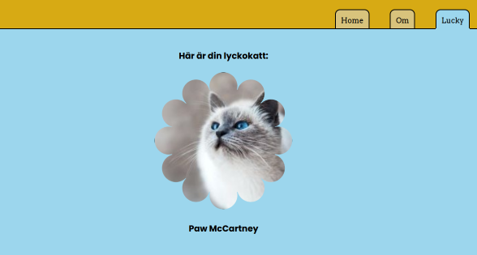

MVC
=====
Det här är min README för mitt kursrepo i kursen MVC.

Klona mitt repo
-----------
Gör såhär för att klona mitt repo:
1. Öppna terminalen
2. Ställ dig i vald katalog
3. Kör följande kommando:
```
git clone https://github.com/lisarosengren/MVC.git
```

Förberedelser för att kunna köra webbplatsen
------

### Förutsättningar
Du har installerat PHP 8.3
Du har installerat composer


Ställ dig i MVC och kör följande kommandon:
```
composer install
```
```
npm install 
```
```
npm run build
```

Kör webbplatsen
-----
```
symfony server:start
```

(klicka på lucky-fliken så får du se katt!)
