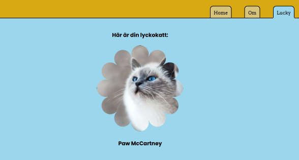

[](https://scrutinizer-ci.com/g/lisarosengren/MVC/?branch=main) [](https://scrutinizer-ci.com/g/lisarosengren/MVC/?branch=main) [](https://scrutinizer-ci.com/g/lisarosengren/MVC/build-status/main) 



MVC
=====
Det här är min README för mitt kursrepo i kursen MVC.

I kursen har jag skapat en webbplats med hjälp av modeller, vyer och controllers. Där finns det jag har åtstadkommit i kursen. Allt från lyckokatter till kortspel. Det finns en speciell del som handlar om slutprojektet för kursen, den delen har en annan styling och erbjuder möjligheten att spela ett äventyrsspel! Resultatet kan du se om du följer nedanstående steg.

Klona mitt repo
-----------
Gör såhär för att klona mitt repo:
1. Öppna terminalen
2. Ställ dig i vald katalog
3. Kör följande kommando:
```
git clone https://github.com/lisarosengren/MVC.git
```

Förberedelser för att kunna köra webbplatsen
------

### Förutsättningar
Du har installerat PHP 8.3
Du har installerat composer


Ställ dig i MVC och kör följande kommandon:
```
composer install
```
```
npm install 
```
```
npm run build
```

Kör webbplatsen
-----
```
symfony server:start
```

(klicka på lucky-fliken så får du se katt!)
